# Creating Bots with Azure Bot Service

Industry’s first cloud Bot-as-a-Service, **Azure Bot Service** is a platform that accelerates bot's development. 
It is an integrated environment that enables us to register, build, deploy and manage intelligent bots at once. 
In addition, you can easily integrate [Microsoft Cognitive Services](https://www.microsoft.com/cognitive-services) 
with bots to enhance user experience and interaction. 
The platform is powered by [Microsoft Bot Framework](https://docs.botframework.com/en-us/) and 
[Azure Functions](https://azure.microsoft.com/en-us/blog/introducing-azure-functions/).

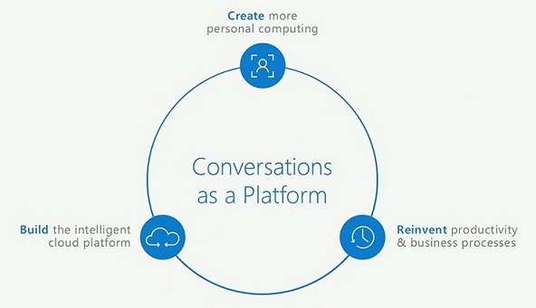 

## Azure Bot Service vs Bot Framework Developer Portal

If you are familiar with bot development using Microsoft Bot Framework you can be thinking about what are the diferences 
between features provided by Azure Bot Service and [Bot Framework Developer Portal](https://dev.botframework.com/).

Azure Bot Service is integrated with Azure environment and Microsoft Cognitive Services. 
It means that in a single platform you can create a messaging endpoint, build, deploy and manage your bots. 

On the other hand, Bot Framework Developer Portal doesn't have these integrations. 
You can integrate your bot with Azure and Microsoft Cognitive Services, but you need to do it manually. 
The advantage is that it lets you create messaging endpoint with any other cloud provider, not just Azure.

So depending on the scenario, you can implement your bot using Azure Bot Service or Bot Framework Developer Portal.

## Creating a new Bot Service from Azure Portal

First of all, it is necessary to have an **Azure Subscription**. 
For more details, see [How to sign up, purchase, upgrade, or activate Azure](https://docs.microsoft.com/en-us/azure/billing-buy-sign-up-azure-subscription).

Open the [Azure Portal](https://portal.azure.com) and sign in with your account. Then click on **New [+]** > **Intelligence + analytics** > **Bot Service**.

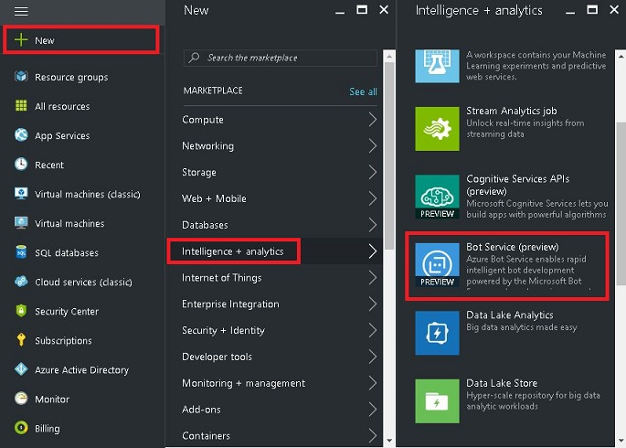 

Fill the required fields and then click on **Create**.

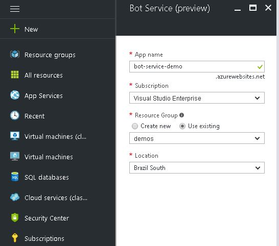

When you create a Bot Service, basically you are creating an Azure Web app with additional features. 
If you go to **App Services** section, you can see the Bot Service app and some detailed information.

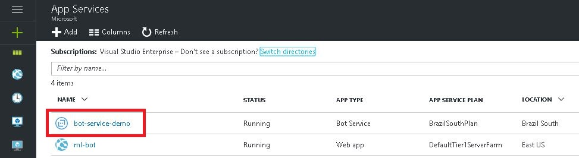

Click on the Bot Service. Now you need to create a **Microsoft App ID** and a **Microsoft App Password**. 
To do this, click on **Create Microsoft App ID and password**. 

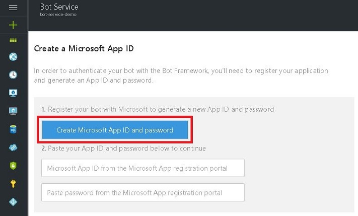

Enter with your Microsoft account and then click on **Generate an app password to continue**.

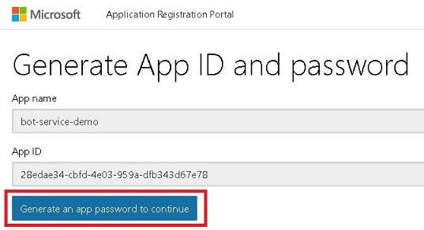

A new password will be generated. Copy this password locally because you will need to paste it in the bot configuration file. 
Then click on **Finish and go back to Bot Framework**. If you have lost or forgotten the password, you can generate a new password later.

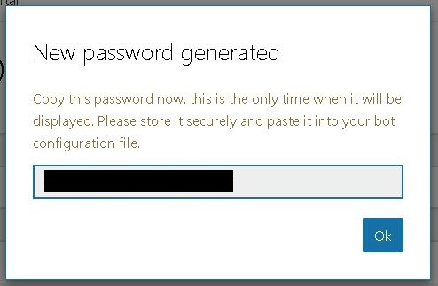

Back to the Azure Portal, paste your password.

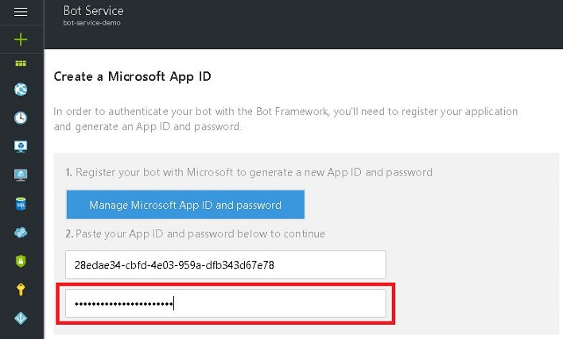

Now you need to choose the programming language that you intend to use.

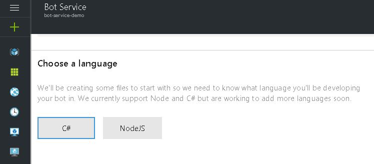

## Choosing a bot template

If you have never created a bot with Bot Framework, you can create a **Basic** template to see how it works. 
The **Form** template shows how a bot can provide a custom form to users. 

If you want to create a bot that triggers an event based on some actions, you can integrate it with *Azure Functions* using the **Proactive** template. 
Natural Language Processing (NLP) is extremely important for chat bots, so you can choose **Language understanding** template and it will integrate a bot with 
[Language Understanding Intelligent Service](https://www.microsoft.com/cognitive-services/en-us/language-understanding-intelligent-service-luis) (LUIS). 

It is important to mention that is possible to merge these templates and add new features. 
For example, you can create a bot that uses NLP to have a natural interaction with users and triggers an event when a specific task is requested.

Select a bot template and click on **Create bot**.

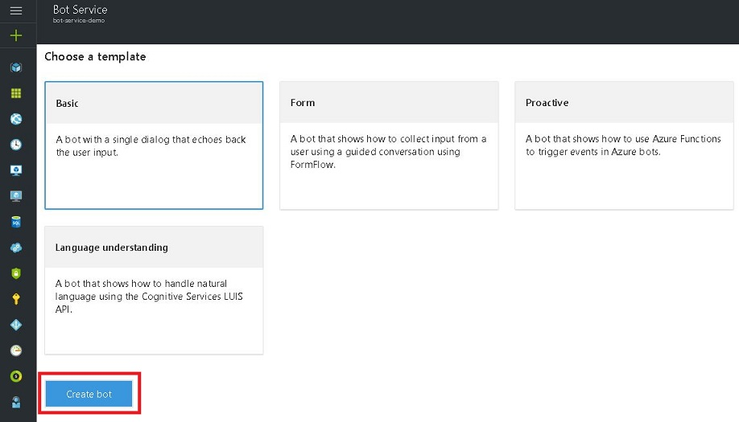

Then a new panel will open. 
In the first tab, on the left you can see the code used for your application and on the right you can see a web chat. 
Once you change the code of your bot, you can check these changes in the web chat. 
This is excellent to improve your productivity while developing the bot.

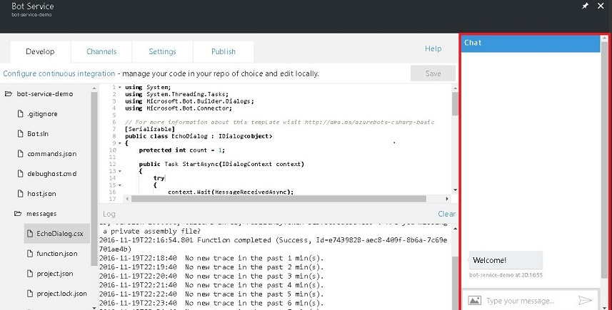

## Testing the bot

If you created a **Basic** template, you can type any word or letter and the bot will echo back your input.

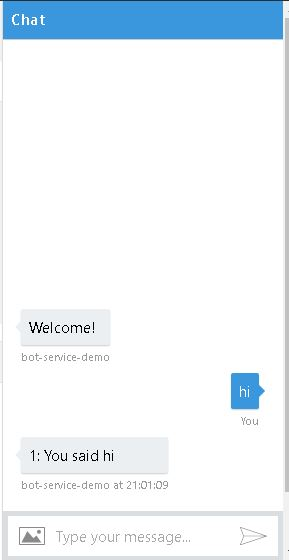

After any change in the code, you can click on **Save** button and test it again in the web chat.

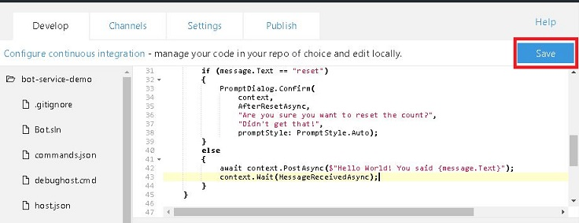

Then go to the web chat and test it again.

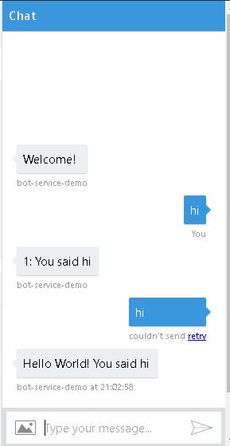

As you can see, it is working as expected!

## Adding Channels

It is possible to add your bot to a lot of different channels, such as Skype, Microsoft Teams, Facebook Messenger and much more. 
To do it, click on the **Channels** tab and add your preferred channels. 

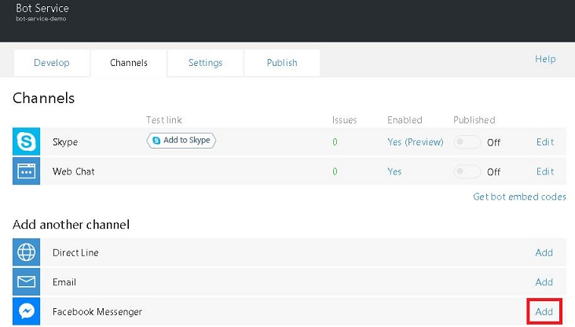

## Bot Settings

If you click on **Settings** tab, you can add image, name and description for your bot.

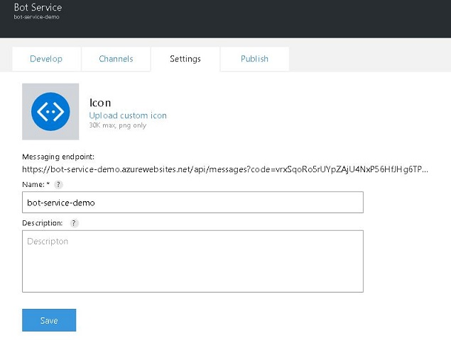

To download the source code and deploy it from an integrated environment, such as GitHub and Visual Studio Team Services, 
go to **Continuous integration** and click on **Configure**.

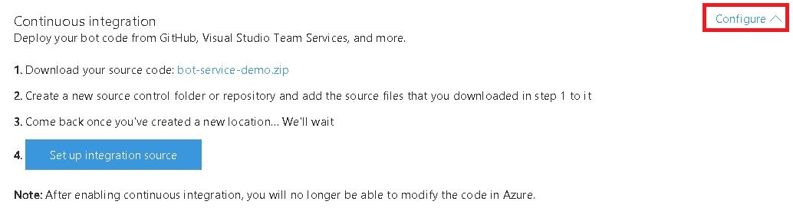

For more information about the service, see the [Azure Bot Service Overview](https://docs.botframework.com/en-us/azure-bot-service/). 
Embrace the digital transformation!

## About the Author

Fernando de Oliveira is Intern at Microsoft, 
author of the book [UX Best Practices for Bot applications](https://aka.ms/ux-chatbots) 
and an open source contributor ([Github](https://github.com/fernandobrs)).
