# Cloud-based Predictive Analytics with Azure Machine Learning

What if you could predict stock prices based on market movement? Or if patients would be at risk of developing certain conditions (like diabetes, asthma and heart disease)? Or even if you could detect fraud?

There are Machine Learning techniques that can be used to make such predictions. In this article I will show how you can create a cloud-based predictive analytics solution with Azure Machine Learning.

## What is Machine Learning?

In few words, Machine Learning is the field of study that gives computers the ability to learn without being explicitly programmed. 
The basic idea is finding meaningful patterns and use them to solve problems.

Problems can be divided into two groups - those that can be solved using standard methods, and those that cannot be solved using standard methods.
For the first group, you have scenarios that based on inputs you know exactly the output (or what is expected as a result).
For the second group you have scenarios that the output is totally unpredictable, like the examples that I mentioned previously.

Unfortunately, most of the real life problems belongs to the second group. 
That's why Machine Learning has been so important and so studied in recent years.

## Microsoft Azure Machine Learning

Azure Machine Learning is a fully managed cloud service that enables you to easily build, deploy, and share predictive analytics solutions.
There is a web-based IDE called <a href="https://studio.azureml.net/" target="_blank">Azure Machine Learning Studio</a> 
for development and deployment of models as web services. 
You can consume these web services using some programming languages such as C#, R and Python.

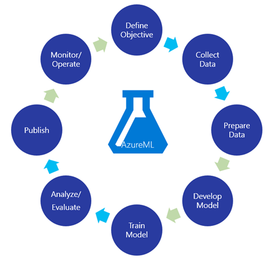 

# Prediction of Parkinson's disease progression
In this article we are going to create a very interesting solution that can help clinicians to predict the progress of patients 
with Parkinson's disease through speech therapy. 

This is how it should work:

1. A clinician provides specific data of the patient during a speech therapy for an application.
2. The data will be processed in a Machine Learning model.
3. The application returns the prediction of the patient's progress to the clinician.

Speech therapy is just one of the many ways to evaluate the progress of a patient. 
If we can predict this progress, certainly it will help clinicians to determine if treatments of a patient have to be intensified or not. 
Our model will follow these steps:

1. Get historical data of patients;
2. Choose and apply a learning algorithm;
3. Train and test the model;
4. Predict the progression.

## What we are going to predict?

Unified Parkinson's Disease Rating Scale (UPDRS) is a scale that quantifies the signs and symptoms of Parkinson's disease. 
Clinicians use the score of UPDRS to follow the progression of a person's Parkinson's disease.

We are going to predict the **total score of UPDRS**. It is a sum of points based on some questions, defining the severity of the disease in a patient. 
The score range is 0 (not affected) to 176 (most severely affected). 
You can find detailed information about UPDRS <a href="http://viartis.net/parkinsons.disease/UPDRS2.pdf" target="_blank">here</a>.

## About the dataset
The dataset that we are going to use as sample is composed of a range of biomedical voice measurements 
from 42 people with early-stage Parkinson's disease recruited to a six-month trial. 

It is important to mention that this dataset doesn't have any sensitive data and it is opened for community 
through [UCI Repository](https://archive.ics.uci.edu/ml/datasets/Parkinsons+Telemonitoring). 
In this UCI web page you can download the dataset (.data file) that we are using and see all information about its attributes and metadata. 
If you want to have the dataset as a CSV file, just download it and change the .data file extension to .csv extension.

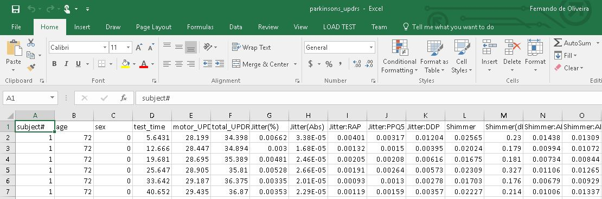 

## Creating the Experiment
First of all, go to <a href="https://studio.azureml.net/" target="_blank">Azure ML Studio</a> website. 
If you already has an Azure subscription, you can just sign in. 
If you just want to do some tests, you can try it for free choosing the trial version.

In Azure ML Studio, click on **NEW**, select **EXPERIMENT** and then *Blank Experiment*.

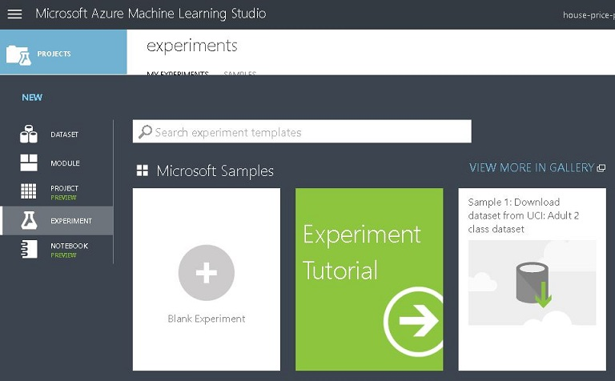

## Get historical data of patients

Basically there are two ways of importing data:

* Upload a new dataset from local file. To do this, click on **NEW**, select **DATASET** and then *FROM LOCAL FILE*.
* Point to a data source, such as: Web URL, Azure Storage, on-premises SQL database, etc.

I'll choose to point to a data source, because we already have the dataset sample on UCI webpage.
In the search box, search by **Import Data** and drag it to the experiment area. 
This item will be used to import the dataset containing our historical data.

In *Properties*, choose *Web URL via HTTP*, provide the *Data source URL* (you can get it <a href="https://archive.ics.uci.edu/ml/machine-learning-databases/parkinsons/telemonitoring/parkinsons_updrs.data
" target="_blank">here</a>) and choose CSV as *Data format*. As you can see in our CSV file, it has header row. So check the *CSV or TSV has header row* option.

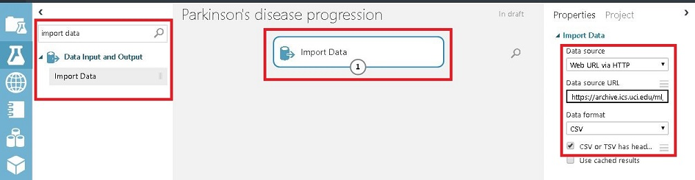

Click on *Run* to process the dataset. After you finish running, right-click on the *Import Data* item, choose *Results dataset* and then *Visualize*. 

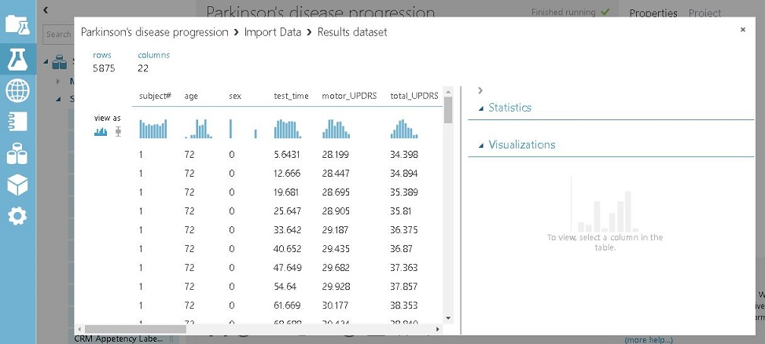

Our historical data will be splitted in two sets: training and testing. 
The training set is used with the learning algorithm for prediction, while testing set is used as input for the model (helping you see how close the prediction is from the actual value).

A fraction of data will be redirected to training set and the other fraction will be redirected to testing set. 
To improve the quality of prediction and at the same time have good amount of data for tests, let's split 75% of our data for training set and 25% for testing set.

To do this, search by **Split Data** and drag it to the experiment area. In *Properties*, change *Fraction of rows in the first output dataset* to 0.75. 
Then connect the output of **Import Data** to the input of **Split Data**, as you can see in the image below:

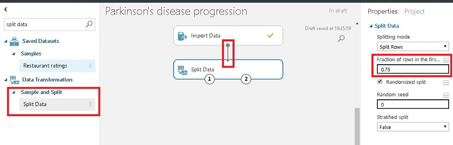

## Choosing a learning algorithm

Our dataset is ready to be used and now we need to choose the learning algorithm that fits to our needs. 
There are a lot of algorithms for different purposes. Basically these algorithms are splitted in three types:

* **Supervised Learning:** Given some inputs and desired outputs by a data source, the goal is to learn a general pattern that maps these inputs and outputs. 
So you provide the right answer in advance.

* **Unsupervised Learning:** The algorithm figure out the inputs and outputs itself. One example is *image classification* problem. 
You probably don't know what the pictures are about, so it will need to find out similarities in the input data and figure out itself 
the best way to classify the pictures into proper groups.

* **Reinforcement Learning:** Is the problem of getting an agent to act in a dynamic environment so as to maximize its rewards. 
For example, consider teaching a dog a new trick: you cannot tell it what to do, but you can reward/punish it if it does the right/wrong thing. 
It has to figure out what it did that made it get the reward/punishment. 
We can use a similar method to train computers to do many tasks, such as playing chess, driving vehicles, scheduling jobs, etc.

Supervised Learning is the type that fits in our problem. There are two techniques that can be used: *regression* and *classification*.

* **Regression:** You have a dataset and you want to use it to make predictions. A common example is predicting the price of a house given its size in feet. 
Based on historical data, the algorithm creates the line that fits better for general cases. This line corresponds to a mathematical equation. 
So, when you have an equation you can find any output (y) given any input (x). 
This process is known as **Linear Regression** and this is what we are going to use. 

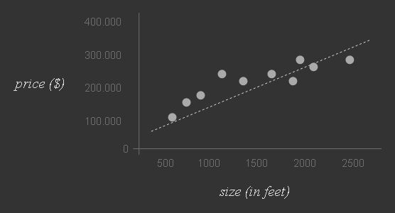

* **Classification:** You have a dataset and you want to identify to which set of categories the input data belongs. 
Some examples are pattern recognition and email validation ("spam" or "non-spam").

In our case we want to use a regression algorithm, that's why I decided to use Linear Regression. 
There are a lot of regression algorithms that you can use, but for our case Linear Regression is enough. 
If you want to know more about learning algorithms that you can use, see [How to choose algorithms for Microsoft Azure Machine Learning](https://docs.microsoft.com/en-us/azure/machine-learning/machine-learning-algorithm-choice).

## Train and test the model

We defined the learning algorithm. Now it's time to apply it to the dataset and train the model. 
Drag a **Linear Regression** and a **Train Model** item to the experiment area. 
The **Train Model** will be used to train the motor UPDRS value based on historical data.

Connect the output port of **Linear Regression** to the left input port of **Train Model** 
and connect the left output port of **Split Data** to the right input port of **Train Model**. 
The right output port of **Split Data** will be used later. The image below shows the current model.

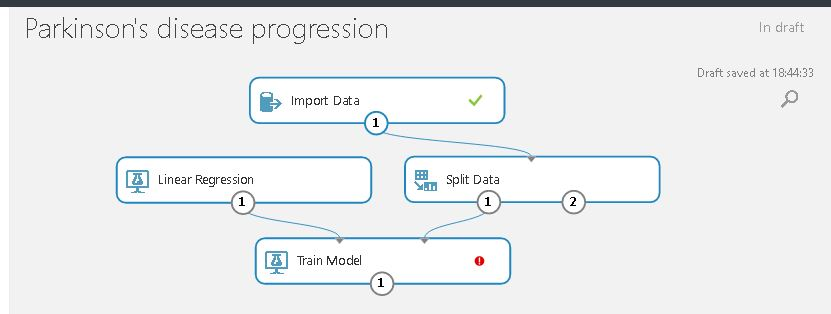

As you can see the **Train Model** item is requiring a value. 
This item will be used for training the *total_UPDRS* value based on *Linear Regression* algorithm.
So click on the Train Model item, go to *Properties* and click on *Launch column selector* button.

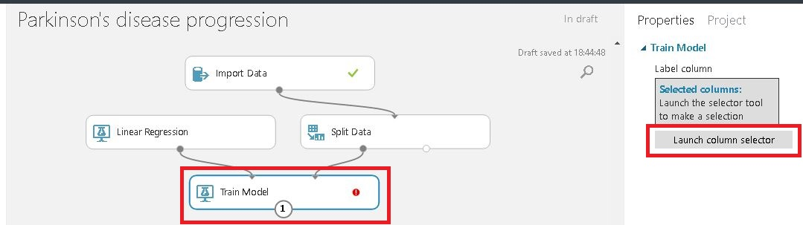

On the left, click on **With Rules** and select *total_UPDRS* column name.

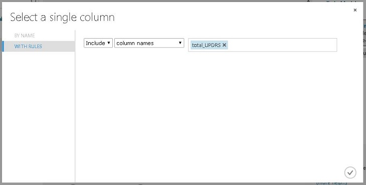

To avoid confusing, is a good practice defining a description for each item. To do this, double click on the Train Model 
(or any other item you want) and input a description.

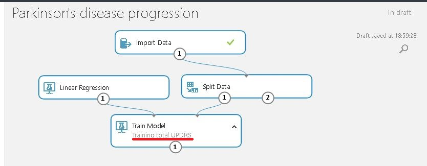

Click on *Run* to start the training. If everything is ok, drag a **Score Model** to the experiment area. 
This item will be used to provide predictions based on the trained model. 
It will use the 25% of data that we splitted for tests previously (in the Split Data item) as input to generate predictions.

Connect the output port of the **Train Model** to the left input port of the **Score Model** and 
connect the right output port of **Split Data** to the right input port of the **Score Model** item.

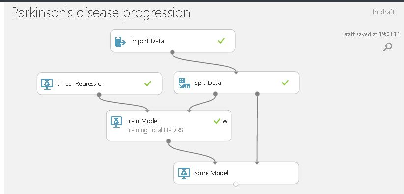

Click on *Run* to update the training. If you want to compare the actual results with predicted results, 
just right-click on the **Score Model**, select *Scored dataset* and then click on *Visualize*.

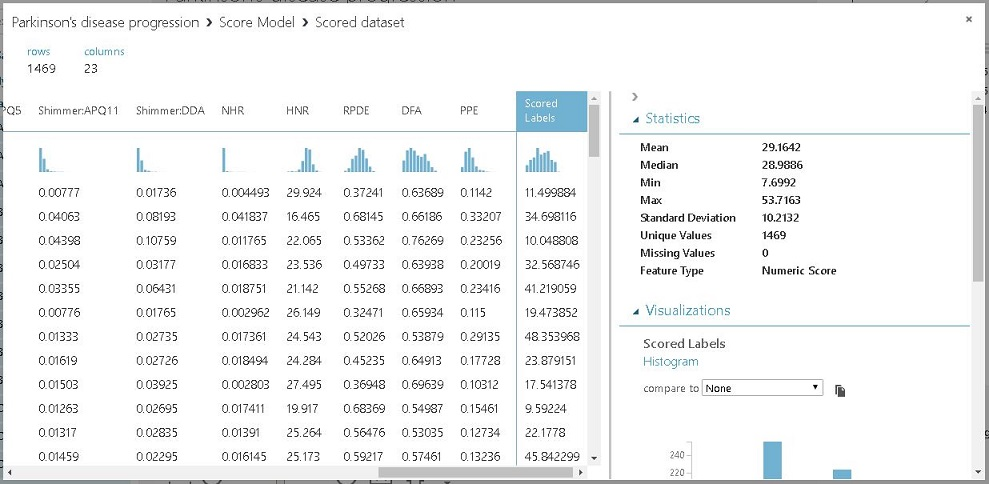

We just want to compare the *total_UPDRS* with *Scored Labels*, so let's remove all other columns. 
Click on the **Score Model**, go to *Properties*, uncheck *Append score columns to output* and click on *Run*. 
If you select *Visualize* again, you will have a visualization similar to this:

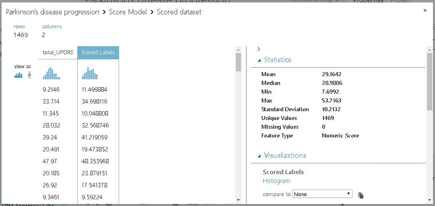

It is much better for comparing data, isn't it? But how can we test the quality of the results? We can do it using an item called **Evaluate Model**. 
It is always recommended to use this item after a Score Model, because it will help you see if the algorithm that you selected previously 
is good enough for your case. If results are not close to what you expected, you can easily go back and choose 
another learning algorithm and train you model again.

So drag a **Evaluate Model** to the experiment area and connect the output port of the **Score Model** to the left input port of the **Evaluate Model**. 
The image below shows the current model.

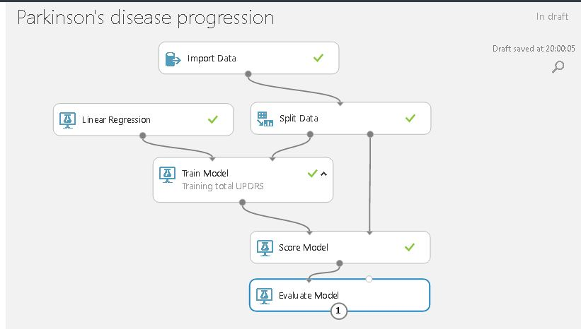

Click on *Run*. To see the evaluation, just right-click on the **Evaluate Model**, select *Evaluation results* and then click on *Visualize*. 

The coefficient of determination (also known as R squared value) for motor UPDRS is about 90%. 
It is a statistical metric indicating how well a model fits the data. 
For demo purposes this percentage is enough, but depending on the situation in a real case it must be improved.

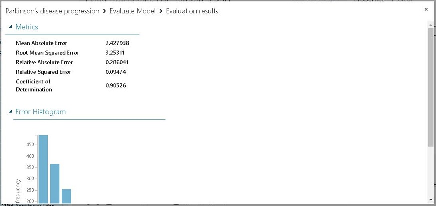

After some tests we could see that predictions are occuring as expected. Our output on **Score Model** is returning with two columns 
(because we were comparing results previously). But now we just want prediction values as output, so let's remove the *total_UPDRS* column.

To do this, you can remove the **Evaluate Model**, drag the **Select Columns in Dataset** item and connect it with the **Score Model**. 
The image below shows how it should be:

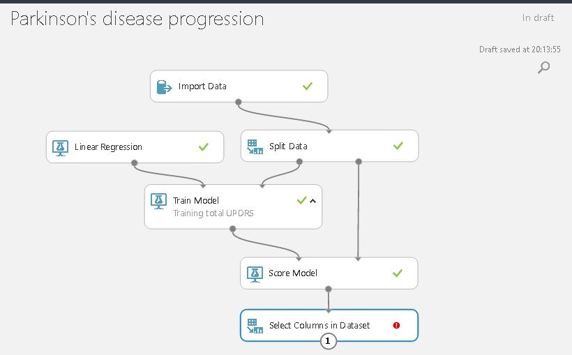

Now click on **Select Columns in Dataset**, go to *Properties* and click on *Launch column selector* button. 
On the left, click on **With Rules** and **No Columns**. Select **Include**, **column names** and enter the *Scored Labels* column name. 

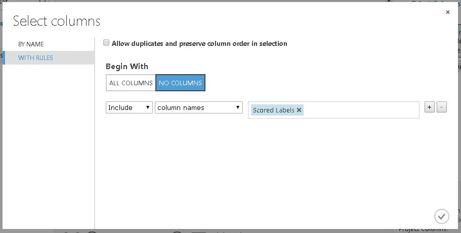

Confirm the column name and then click on *Run*. We finished our training experiment for total UPDRS prediction! 

## Converting to predictive experiment

Before deploying the web service, it is necessary to convert the training experiment to a predictive experiment. 
This convertion will add some items, as **Web service input** and **Weeb service output**, and remove unnecessary items.
Click on **Set Up Web Service**, then **Predictive Web Service [Recommended]**.

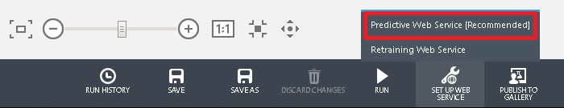

It will automatically convert your training experiment to a predictive experiment, so users can send data to your model 
and receive your model's predictions. For more information about experiment convertion, see 
[Convert a Machine Learning training experiment to a predictive experiment](https://azure.microsoft.com/en-us/documentation/articles/machine-learning-convert-training-experiment-to-scoring-experiment/). 

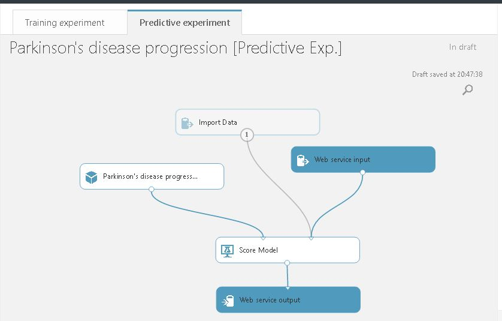

Now **Run** your predictive experiment. 
By default, the **Web service input** item will set all columns of the dataset as input parameters. 
As we don't want total UPDRS as input (because the prediction have to be an output), we need to change input parameters. 
Drag a **Select Columns in Dataset** item, connect it with the **Import Data** and connect its output port with the right input port of **Score Model**. 

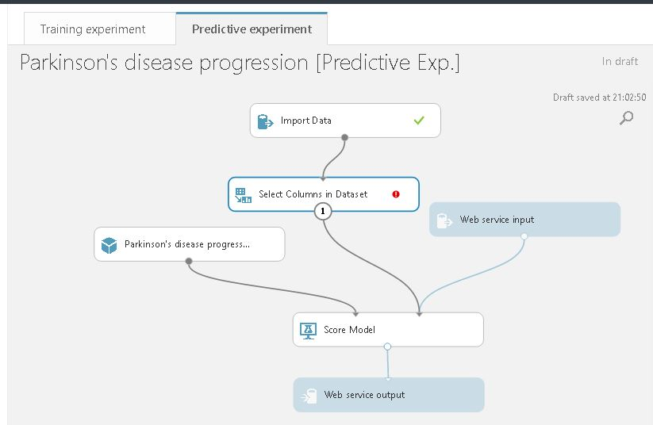

Click on **Select Columns in Dataset**, go to *Properties* and click on *Launch column selector* button. 
On the left, click on **With Rules** and **All Columns**. Select **Exclude**, **column names** and enter the *total_UPDRS* column name. 
After confirming the column name, click on *Run*.

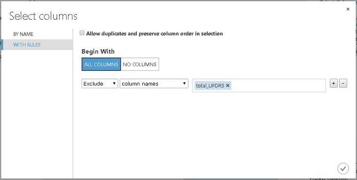

If you want to change the *Scored Labels* column name as output, you can use the **Edit Metadata** item. 
Drag and connect it between the **Score Model** and **Web service output**.

On *Properties*, click on *Launch column selector* button. On **With Rules** select **No Columns**, 
then select **Include**, **column names** and enter the *Scored Labels* column name. Click on the confirm button.

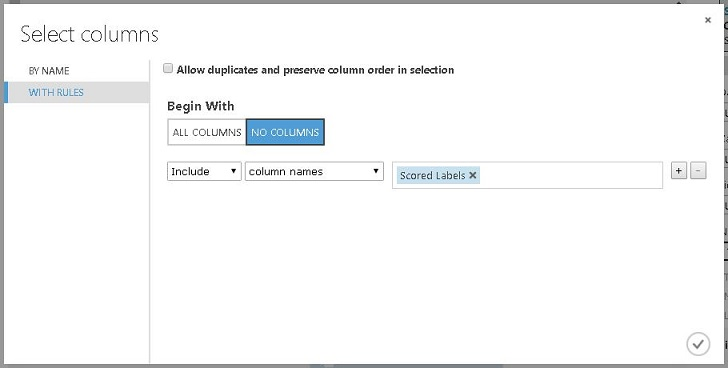

Now click on the **Edit Metadata** item, go to *Properties* and enter the output name that you desire in *New column names* field. 
Then, click on *Run*.

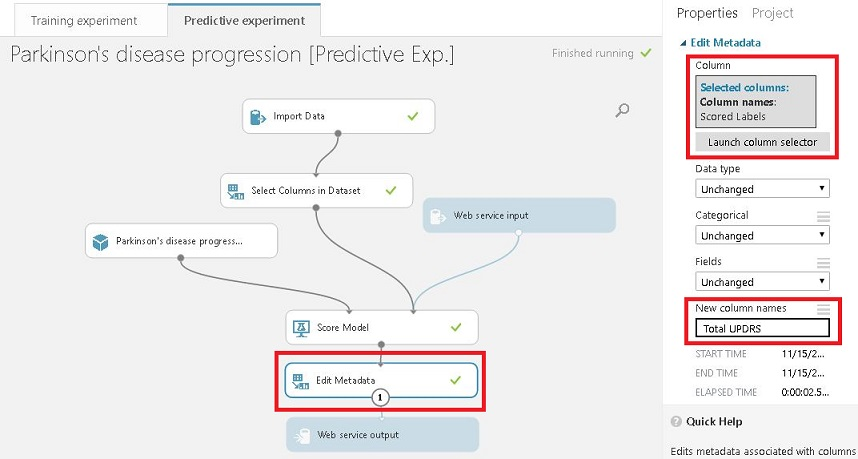

## Deploying the Machine Learning Web Service

Click on **Deploy Web Service** and then select **Deploy Web Service [New] Preview**.

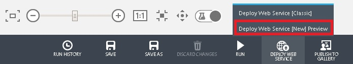

A new page will open and you need to provide a web service name and a price plan. 
There is a free plan option if you intend to use the web service just for tests. Then, click on **Deploy** button.

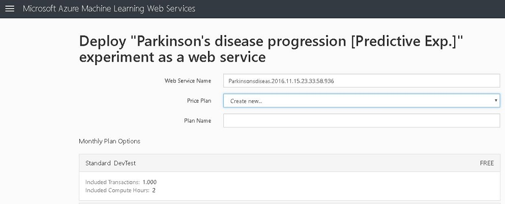

Let's test if the web service is running as expected? When the deploy is complete, a new page will open and you can click on **Test Web Service**.

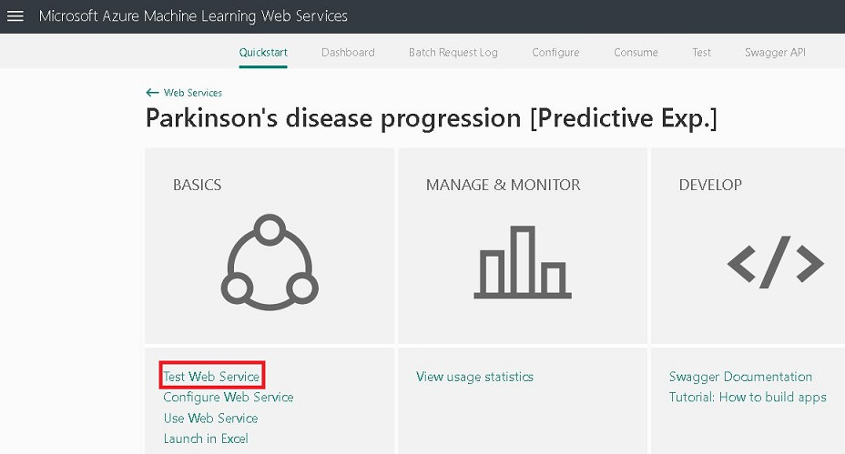

Enter the input values and then click on **Test Request-Response** button.

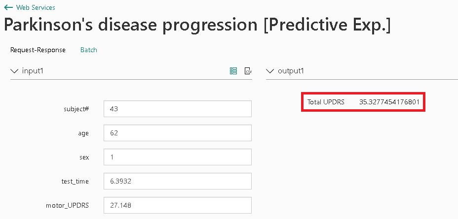

The web service is working! On the right side you can see the predicted outcome. 
If you want to integrate the web service with your C#, Python or R application 
you can click on **Consume** tab and go to **Sample Code** section.

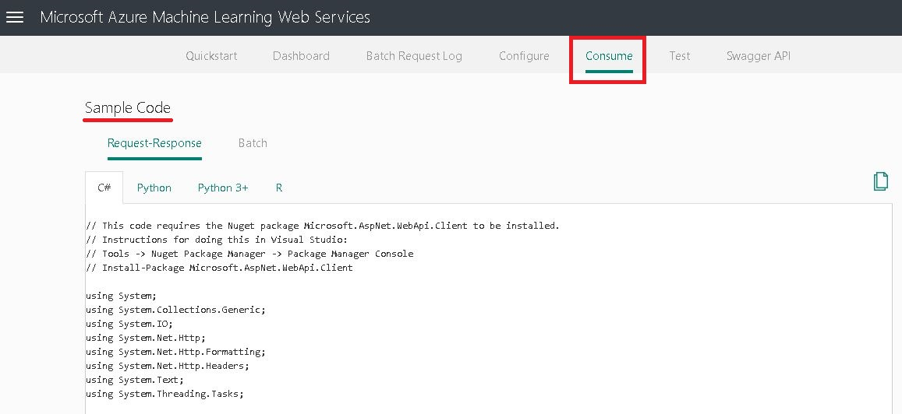

## Conclusion

As we could see, Azure Machine Learning can be applied in a lot of different scenarios. 
For predictive analytics, the biggest challenge is defining what learning algorithm you 
should use and what data are relevant to solve the problem. 
Dragging items are very intuitive and you don't necessarily need to write code for simple tasks.

In few minutes you can create an amazing predictive analytics solution using the power of cloud computing. 
Embrace the digital transformation!

## About the Author

Fernando de Oliveira is Intern at Microsoft, 
author of the book [UX Best Practices for Bot applications](https://aka.ms/ux-chatbots) 
and open source contributor ([Github](https://github.com/fernandobrs)).
